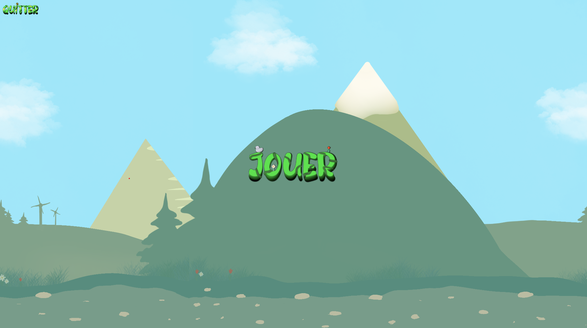
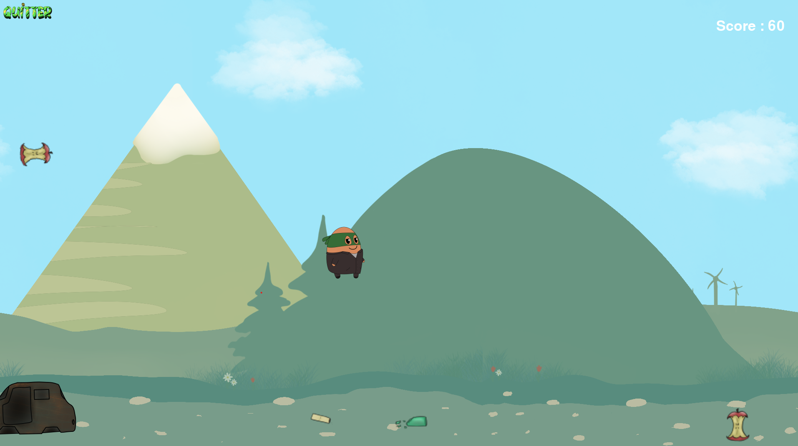

# Projet Trophée NSI 2023
### Par "Les reconditionnés"

Eco World est un mini-jeu qui permet de sensibiliser les joueurs sur l'écologie.

## Installation

La façon la plus simple d'installer notre projet est de télécharger le fichier zip depuis le site github, puis de l'extraire dans un dossier de votre choix.

## Lancement

Afin de simplifier le lancement de notre projet, nous avons inclus un dossier python qui contient une installation de python et des dépendances nécessaires, il est donc inutile d'ouvrir ce dossier qui ne représente pas notre travail

Ainsi, pour lancer notre projet, exécutez la commande depuis le dossier racine : `python\python.exe -m main.py` ou lancez le fichier start.bat qui le fera à votre place.

##### Python déjà installé ?

Si python est déjà installé sur votre ordinateur, vous pouvez lancer le fichier main.py avec la commande `python -m main.py` ou `python3 -m main.py` depuis le dossier racine

Vous devrez installer la librairie pygame en utilisant la commande `pip install pygame`.

## Utilisation

Le jeu est très simple à utiliser, vous arrivez sur un écran pour lancer le jeu.
Utilisez ensuite les flèches directionnelles pour vous déplacer et la touche espace pour sauter.
Vous pouvez faire un double saut en sautant pendant que vous êtes en l'air.
Pour quitter le jeu, utilisez le bouton dédié en haut à gauche de l'écran.
Vous pouvez perdre en touchant un obstacle ou en ayant un score inférieur à 50.
Vous gagnez 7 points en ramassant un déchet et en perdez 5 en en laissant passer un.

## Captures d'écran

## Remarque

Le fichier main.py ne sert qu'au lancement de game.py, se trouvant dans le dossier /sources et qui contient le code du jeu.

## Crédits

Lucile Pruvost, Matéo Wache, Gabriel Gardia Parege, Kylian Dupouy Peron
